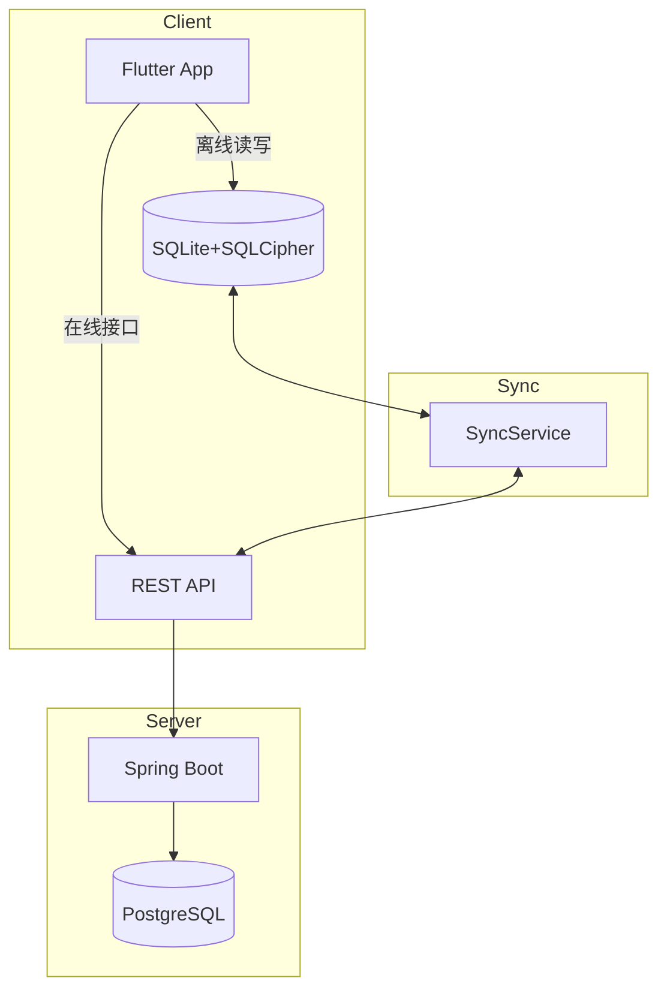

# 见山（Seek）

> 主动、有目的的追寻，关乎外在的风景，也关乎内在的宁静。既是目标，也是过程本身。

见山是一款「离线优先 + 实时同步」的多端数据记录管理工具：无网时可读可写，网络恢复即自动同步，确保数据在移动端、Web、桌面端始终一致。

***

## 1. 核心能力

* **离线优先**：内置 SQLite + SQLCipher，本地加密存储；断网环境下仍可浏览、新增、编辑。

* **实时同步**：自定义同步协议（变更日志 + 向量时钟），支持增量拉取、断点续传与冲突解决。

* **多端一致**：Flutter 跨 iOS / Android / macOS / Windows / Linux / Web；同一账号多端登录，数据自动对齐。

* **安全隐私**：数据库级加密 + 传输层 HTTPS；密钥由用户口令派生，服务端无法解密。

* **模块化架构**：Controller → Service → Repository 分层，业务逻辑集中在 Service，易扩展、易测试。

***

## 2. 系统整体架构



**数据流说明**

1. **离线模式**：Controller 调用 Service，Service 通过 Repository 写入本地 SQLCipher；读写完全脱离网络。
2. **在线模式**：Service 检测到网络可用时，通过 HttpClient 调用 RESTful API，数据落盘 PostgreSQL。
3. **同步触发**：网络恢复或用户手动下拉 → SyncService 读取本地 `change_log` → 增量推送 / 拉取 → 冲突解决（默认“后改优先”，可扩展手动合并）。

***

## 3. 各端功能与实现方式

### 3.1 移动端（Flutter）

| 功能   | 实现方式                                                                                                |
| ---- | --------------------------------------------------------------------------------------------------- |
| 本地存储 | `sqflite_sqlcipher` 插件提供 SQLite + 256-bit AES 加密；表结构在应用首次启动时通过迁移脚本创建。                               |
| 离线读写 | 所有写入先写 `change_log`（含 `changeId` / `table` / `operation` / `vectorClock`），再写业务表；读取直接走本地 Repository。 |
| 同步引擎 | `SyncService` 根据向量时钟计算差异：本地 > 远程则推送，远程 > 本地则拉取；大文件分片上传，失败自动重试。                                      |
| 网络探测 | 使用 `connectivity_plus` 监听网络状态；由 `RepositoryFactory` 自动切换本地或远程数据源，对 UI 无感知。                          |
| 加密密钥 | 用户注册时输入口令，通过 `crypto` 库的 `pbkdf2` 生成 256-bit 密钥，存储于 `FlutterSecureStorage`，每次启动解密数据库。               |

### 3.2 Web 端（示例 React）

| 功能   | 实现方式                                                                                  |
| ---- | ------------------------------------------------------------------------------------- |
| 本地缓存 | IndexedDB（通过 `idb` 库）存储离线数据；同步逻辑与移动端共用同一套 TypeScript SDK（封装在 `/web/src/api/sync.ts`）。 |
| 增量同步 | SDK 维护本地向量时钟，调用 `/sync/diff` 接口获取差异后，合并到 IndexedDB，并反向提交本地变更。                         |
| 冲突解决 | 与移动端策略一致：先比较向量时钟，再按“后改优先”自动合并；若业务需要，可弹出手动合并弹窗。                                        |
| 文件上传 | 大文件切片后逐片调用 `/sync/upload_chunk`，最后发送 `/sync/merge_chunk` 完成合并；支持暂停与续传。                |

### 3.3 后端（Spring Boot）

| 功能          | 实现方式                                                                                               |
| ----------- | -------------------------------------------------------------------------------------------------- |
| RESTful API | 使用 Spring Web 提供资源风格接口，如 `GET /notes/{id}`、`POST /sync/diff`；统一封装返回体 `Result<T>`。                  |
| 增量差异        | 服务端基于 PostgreSQL 的 `change_log` 表（结构与客户端一致），根据客户端传来的向量时钟生成差异 JSON，返回时 gzip 压缩。                     |
| 冲突检测        | 收到客户端变更后，先对比服务端最新向量时钟，若出现“同一记录、同一版本窗口”双端修改，则标记冲突并返回冲突详情，由客户端决定合并策略。                                |
| 文件分片        | 提供 `/sync/upload_chunk` 与 `/sync/merge_chunk` 接口；临时分片存储于本地磁盘或 S3 兼容对象存储，合并后生成文件记录并更新 `change_log`。 |
| 数据加密        | 传输层强制 HTTPS；业务层可选字段级加密（客户端自行加解密，服务端仅透传）。                                                           |

***

## 4. 离线-在线同步机制

1. **变更日志（change\_log）**：每条本地写入生成唯一 `changeId` + `vectorClock` + `operation`（INSERT / UPDATE / DELETE），确保全局可追溯。
2. **增量拉取**：客户端携带本地最新向量时钟调用 `/sync/diff`，服务端返回差异数据；客户端按主键合并到本地表，并更新时钟。
3. **冲突解决**：若同一记录在同一版本窗口被双端修改，则进入冲突分支：默认“后改优先”，业务层可扩展手动合并 UI。
4. **断点续传**：大文件切片上传，每片带 `chunkIndex` / `totalChunks` / `fileId`；服务端临时保存，最后合并并生成文件记录。
5. **加密与完整性**：本地数据库 SQLCipher 全盘加密；传输层 HTTPS + gzip；文件可选客户端 AES 加密，服务端仅做字节透传。

***

## 5. 目录结构速览

```
seek/
├── mobile/                      # Flutter 跨端应用
│   ├── lib/
│   │   ├── config/              # 主题、路由、环境配置
│   │   ├── models/              # Dart 数据模型（json_serializable）
│   │   ├── pages/               # 业务页面（View + Controller）
│   │   ├── services/            # 业务逻辑层（离线/在线切换、同步引擎）
│   │   ├── repositories/        # 数据访问（SQLite / REST 双实现）
│   │   ├── utils/               # 加密、网络、日期工具
│   │   └── widgets/             # 通用组件
├── web/                         # Web 前端（示例 React）
│   ├── src/
│   │   ├── api/                 # 统一请求封装（含离线队列）
│   │   ├── components/          # 通用组件
│   │   ├── pages/               # 页面级组件
│   │   ├── hooks/               # 自定义 Hooks（同步、网络）
│   │   └── utils/               # 工具函数
├── server/                      # Spring Boot 后端
│   ├── src/main/java/
│   │   ├── config/              # Swagger、JPA、跨域、安全
│   │   ├── controller/          # REST 入口（仅调用 Service）
│   │   ├── service/             # 业务逻辑（事务、校验、冲突解决）
│   │   ├── repository/          # JPA 数据访问层
│   │   ├── dto/                 # 请求/响应对象
│   │   └── entity/              # JPA 实体
│   └── src/main/resources/
│       └── db/migration/        # Flyway 数据库迁移脚本
├── docs/                        # 架构与协议文档
├── i18n/                        # 国际化 JSON
└── docker/                      # 全局 Docker 脚本
```

***

## 6. 许可证与联系方式

* 许可证：[MIT](LICENSE) © 2024 见山 Contributors

* 项目主页：<https://github.com/your-org/seek>

* 问题与需求：请提交 [GitHub Issues](https://github.com/your-org/seek/issues)

* 邮箱：<seek@example.com>

***

> 山高路远，见山而行。让知识在无网时也能生长，在有网时自由流动。

